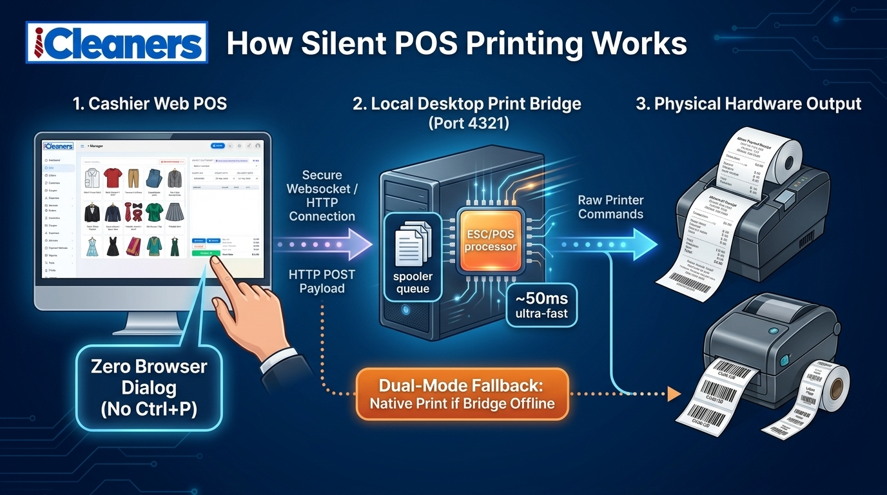

# iCleaners &mdash; Multi-Store Laundry & Dry Cleaning Management System with Silent Thermal POS & Wash Tag Printing

> **The Ultimate All-in-One Cloud & Local ERP for Modern Laundromats, Dry Cleaners, Alteration Shops & Multi-Branch Laundromat Franchises.**

[](https://nodejs.org)
[](https://mysql.com)
[](https://getbootstrap.com)
[](#10-multilingual--full-rtl-support)
[](#hardware-integration--silent-printing-server)
[](https://codecanyon.net)

---

## Slogans & Taglines
* **Primary Slogan**: *Scale Your Laundry Business from a Single Shop to a Multi-Store Franchise with Zero-Click Silent Hardware Printing.*
* **Secondary Slogan**: *Enterprise-Grade Laundry Point of Sale, Barcoded Garment Wash Tags & Multi-Branch Accounting Made Effortless.*
* **Tagline**: *Modern Web POS &bull; Hardware Printing Server &bull; 10 Languages &bull; Complete Financial Ledger.*

---

## Tags & Search Keywords (CodeCanyon Ready)
`laundry`, `dry cleaning`, `laundry pos`, `laundromat`, `point of sale`, `silent printing`, `thermal printer`, `escpos`, `cloth tags`, `garment tags`, `wash tags`, `barcode pos`, `multi store`, `multi branch`, `laundry erp`, `customer ledger`, `nodejs pos`, `express pos`, `mysql pos`, `bootstrap 5 pos`, `arabic rtl`, `multilingual`, `profit and loss`, `accounting pos`, `franchise management`, `receipt printer`, `order tracking`, `pos system`, `dark mode pos`, `laundry software`

---

## 1. Product Overview & Executive Description

**iCleaners** is an enterprise-grade, multi-store Laundry and Dry Cleaning Management ERP built with **Node.js, Express, MySQL, and modern Bootstrap 5**. Designed specifically to solve the real-world operational bottlenecks of laundry businesses, iCleaners bridges the gap between high-speed cloud business management and physical store hardware.

Unlike generic POS systems that struggle with garment identification and continuous roll printing, **iCleaners features an integrated Silent Printing Server**. Cashiers can process orders and instantly print **80mm / 58mm thermal receipts** and **waterproof 75mm / 50mm garment cloth wash tags with Code128 barcodes** &mdash; completely bypassing the browser's slow and disruptive `Ctrl+P` print dialog!

Whether running a boutique dry cleaner, a commercial laundromat, or an expanding franchise network across multiple locations, iCleaners empowers store owners with **real-time financial ledgers, franchisee commission tracking, multi-currency support, SMS/email customer notifications, and a fully localized interface supporting 10 languages (including native RTL for Arabic)**.

---

## 2. In-Depth Feature Highlights

### 🚀 High-Speed Interactive Point of Sale (POS)
* **Single-Screen Workflow**: Select store, search/add customers, pick services with real-time price calculations, apply coupon codes, and choose payment methods on one intuitive dashboard.
* **Service Customization & Add-ons**: Group services into categories (Dry Clean, Wash & Fold, Steam Press, Alterations, Stain Removal) with optional dynamic add-ons (Express delivery, Scented wash, Softener).
* **Instant Customer Creation**: Register new clients on the fly directly inside the POS modal without abandoning active shopping carts.
* **Barcode Scanner Ready**: Compatible with USB and Bluetooth barcode scanners for fast order retrieval and pickup scanning.

### 🖨️ Dual-Mode Silent Hardware Printing System (Industry Game-Changer!)
* **Silent Printing Server (Desktop Bridge on Port 4321)**: Connects the browser web application directly to the OS print spooler. Zero dead clicks, zero popup confirmations, 50ms execution speed.
* **ESC/POS Pin-Level Commands**: Native low-level byte stream control for lightning-fast thermal printing without memory overhead.
* **Dual Printer Support**:
  * **Thermal Receipt Printer (80mm / 58mm)**: Customer itemized bill, tax breakdown, barcode, store logo, customizable footer, and automatic cash drawer kick.
  * **Garment Wash Tag Printer (75mm / 50mm)**: Waterproof nylon cloth wash tags printed per garment item with Code128 barcodes, garment type, customer name, and rack ID.
* **Graceful Browser Fallback**: If the local printing server is offline or unreachable, the POS automatically falls back to standard browser printing (`window.print()`), guaranteeing zero downtime.

### 🏢 Multi-Store & Franchise Multi-Branch Management
* **Store-Scoped Architecture**: Run unlimited branch stores under a single central master installation.
* **Branch-Level Isolation**: Store Managers and Cashiers only access their respective store's orders, cash drawer, inventory, and customers.
* **Franchise Commission System**: Configure custom commission percentage rates per branch with automated payout ledger calculations.
* **Store Self-Registration**: Enable prospective branch owners to apply online with master admin approval workflows.

### 📊 Financial Accounting, Cash Management & Reports
* **Comprehensive Customer Ledger**: Track debit/credit balances, advance deposits, customer receivables, and payment histories.
* **Store Cash Drawer Management**: Track daily cash in/out, expenses, cashier float balances, and register closures.
* **Executive Reports Suite**:
  * **Daily Summary Report**: Cash vs. Card vs. UPI/Online daily totals.
  * **Order Reports**: Search and filter by date, store, delivery status, and payment state.
  * **Sales & Revenue Report**: Net sales, gross discounts, and delivery surcharges.
  * **Tax / VAT Reports**: Compliant breakdown of collected VAT/GST per store.
  * **Profit & Loss (P&L) Statement**: Real-time net margin calculation (Gross Revenue &minus; Store Expenses).
* **Excel & CSV Export**: Export any report with one click via integrated `ExcelJS`.

### 🌐 10-Language Localization with Native RTL
* **10 World Languages Pre-Installed**:
  * English (`en`)
  * Hindi (`in`) &mdash; हिन्दी
  * Portuguese (`pt`) &mdash; Português
  * Spanish (`es`) &mdash; Español
  * French (`fr`) &mdash; Français
  * Chinese (`cn`) &mdash; 中文
  * Arabic (`ae`) &mdash; العربية *(Full RTL Layout)*
  * Indonesian (`id`) &mdash; Bahasa Indonesia
  * Filipino (`ph`) &mdash; Filipino / Tagalog
  * Ukrainian (`uk`) &mdash; Українська
* **100% Dictionary Key Parity**: Over 466 standardized translation keys per language.
* **Transparent Fallback Proxy**: Zero broken strings. If a custom key is omitted in any language, it seamlessly falls back to English and humanized labels.
* **Instant Dynamic Switching**: Change languages instantly from the topbar or login screen without page errors.

### 🛡️ Enterprise Security & Role-Based Access Control (RBAC)
* **Granular Permissions**:
  * **Master Administrator**: Complete system control, branch approvals, commission payouts, global settings.
  * **Store Manager**: Branch order oversight, staff management, store financial settings.
  * **Cashier / POS Operator**: POS booking, order updates, customer receipts.
  * **Customer Portal**: Self-service tracking, invoice download, service catalogue review.
* **Secure Authentication**: Encrypted bcrypt passwords, JWT cookie validation, XSS protection, SQL injection hardened queries, and CSRF mitigation.

---

## 3. Comprehensive Feature Matrix

| Functional Module | Features Included |
| :--- | :--- |
| **Command Center Dashboard** | Real-time sales KPIs, order volume charts, active stores overview, recent order stream, store-scoped statistics, quick-action POS launchers. |
| **Point of Sale (POS)** | Live cart calculation, instant customer modal, dynamic discounts, coupons, barcode wash tags generation, partial payments, multiple payment gateways. |
| **Silent Printing Engine** | Local server on port 4321, 80mm/58mm thermal receipts, 75mm/50mm garment tags, Code128 barcodes, ESC/POS byte-level commands, browser print fallback. |
| **Order Management** | Order status lifecycle (`Pending`, `Processing`, `Ready for Delivery`, `Delivered`, `Cancelled`), garment inspection notes, tracking barcodes. |
| **Customer Hub** | Comprehensive CRM, customer ledger (Credit/Debit history), advance deposits, order history, SMS & email notifications. |
| **Service Catalog** | Categories, services with photo upload, item unit pricing (per piece, per kg, per meter), dynamic add-on charges (express service, starch, stain treatment). |
| **Cash Management** | Cash drawer open/close, multi-store accounts, deposit & withdrawal tracking, store expense recording with categorization. |
| **Franchise / Branch Tools** | Multi-store setup, store branding (logos, address, VAT), manager credentials, custom commission rates, payout records. |
| **Reports & BI** | Daily reports, sales reports, order reports, expense reports, tax reports, Profit & Loss statement, 1-click Excel export. |
| **Theme & UI/UX** | Bootstrap 5, Liquid Glass design system, Dark/Light mode switcher with persistence, Server-Side DataTables with 400ms debounce. |
| **Internationalization** | 10 Languages pre-configured, native RTL engine for Arabic, seamless language fallback proxy. |
| **Customer Self-Service** | Dedicated customer portal, self-registration, order history lookup, invoice print. |

---

## 4. Hardware Integration & Silent Printing Server

One of the most valuable competitive advantages of **iCleaners** is its standalone **Silent Printing Server** (`pos-printing-server`). 

```
┌────────────────────────────────────────────────────────┐
│ Cashier's Browser (POS Web App, e.g. http://localhost) │
└──────────────────────────┬─────────────────────────────┘
                           │ HTTP POST (Port 4321)
                           ▼
┌────────────────────────────────────────────────────────┐
│ POS Printing Server (Tray App / Background Service)    │
│  - Endpoint: http://127.0.0.1:4321 (or LAN IP)         │
│  - Spooler Queue: Concurrency 1 (no collision)         │
│  - Formats: ESC/POS & Headless Chromium Roll PDF       │
└──────────────────────────┬─────────────────────────────┘
                           │ Direct Spooler / ESC-POS
                           ▼
┌────────────────────────────────────────────────────────┐
│ Receipt & Tag Printers (USB / Network Thermal Printer) │
│  - 80mm / 58mm Thermal Cash Receipts                   │
│  - 75mm / 50mm Waterproof Garment Wash Tags (Code128)  │
│  - RJ11 / RJ12 Cash Drawer Kick Pulse                  │
└────────────────────────────────────────────────────────┘
```



### Key Printing Specifications
* **Supported Thermal Paper Widths**: 80mm (3-inch standard) and 58mm (2-inch compact).
* **Supported Tag Materials**: Waterproof Nylon, Tyvek, and Adhesive Wash Tag paper (75mm &times; 50mm, 50mm &times; 30mm).
* **Automatic Barcode Tag Generation**: Generates standard Code128 barcodes using `JsBarcode` for each individual garment piece with order number, item sequence (e.g. `ORD-1001-01`), service name, and customer ID.
* **Auto-Cut & Cash Drawer**: Triggers automatic thermal paper cut and RJ11/RJ12 cash drawer pulse upon checkout.
* **Zero Browser Confirmation**: Bypasses the Windows/Mac print dialog completely. Cashiers click "Complete Order & Print", and the ticket prints immediately.
* **Fail-Safe Fallback**: If the local printing server is not active on the workstation, the application automatically launches the standard browser print window (`window.print()`), ensuring cashiers are never blocked.

---

## 5. Technology Stack Breakdown

### Backend & Server Architecture
* **Runtime**: [Node.js](https://nodejs.org) (v16.x, v18.x, v20.x LTS)
* **Framework**: [Express.js](https://expressjs.com) (REST APIs & Controller-Router architecture)
* **Database**: [MySQL](https://www.mysql.com) 5.7+ / 8.0+ or MariaDB 10.3+ (Connection pooling with custom safe query builders)
* **Session & Security**: `express-session`, `cookie-parser`, `jsonwebtoken` (JWT), `bcrypt`, `nocache`
* **File Handling**: `multer` for store logos and service asset management
* **Data Processing & Export**: `exceljs`, `xlsx`, `fast-csv`, `csv-parser`
* **Communication**: `nodemailer` (SMTP Email) and `twilio` (SMS Gateways)

### Frontend & User Experience
* **Template Engine**: [EJS](https://ejs.co) (Embedded JavaScript templates with server-side safety linting)
* **CSS Framework**: [Bootstrap 5](https://getbootstrap.com) (Standardized utility-first components)
* **Custom Styling**: `liquid-glass-theme.css` (Glassmorphism design tokens & Dark/Light mode)
* **Data Tables**: [DataTables](https://datatables.net) with Server-Side processing and 400ms search debounce
* **Barcodes & Charts**: `JsBarcode` (Code128 thermal generation) and `Chart.js` (Executive analytics)
* **UI Components**: `Select2`, `bootstrap-select`, `toastr` notifications, `FontAwesome 6`

---

## 6. System Requirements & Hosting Compatibility

### Minimum Server Requirements
* **Operating System**: Linux (Ubuntu 20.04/22.04 LTS, Debian, CentOS), Windows Server, or macOS
* **Node.js**: Version 16.x, 18.x, or 20.x LTS
* **Database**: MySQL 5.7+ / 8.0+ or MariaDB 10.3+
* **Memory (RAM)**: Minimum 1 GB (2 GB+ recommended for production)
* **Disk Space**: 500 MB free space (plus storage for uploaded store/service images)

### Hosting Environments Supported
* **VPS & Dedicated Servers**: DigitalOcean, AWS EC2, Linode, Vultr, Hetzner, Google Cloud
* **PaaS & Containers**: Docker, Heroku, Render, Railway, CapRover
* **Shared / Managed Hosting**: Any cPanel / Plesk with Node.js Selector (Phusion Passenger / Nginx Reverse Proxy)
* **Local Development**: Laragon, XAMPP, WampServer on Windows; Homebrew on macOS

---

## 7. Installation & Quick Setup Guide

Setting up iCleaners takes under 5 minutes:

### Step 1: Extract & Install Dependencies
```bash
# Unzip project files and navigate to the directory
cd icleaners-pos

# Install backend dependencies
npm install
```

### Step 2: Configure Environment & Database
1. Create a MySQL database (e.g. `icleaners_db`).
2. Import the provided SQL schema from `database/lndry.sql`.
3. Open `config.env` and update your database credentials:
```env
PORT=5000
DATABASE=icleaners_db
USER_NAME=root
PASS_WORD=your_database_password
HOST_NAME=127.0.0.1
PORT_NAME=3306
TOKEN_KEY=your_secret_jwt_key
```

### Step 3: Launch the Application
```bash
# Start in production mode
npm start

# Or with PM2 process manager
pm2 start app.js --name "icleaners"
```
Visit `http://localhost:5000` in your browser.

### Step 4 (Optional): Start Silent Printing Server
1. Launch the included `pos-printing-server` desktop utility on the cashier computer.
2. The server starts on `http://127.0.0.1:4321`.
3. POS tickets and garment tags will now print with zero browser dialogs!

---

## 8. Default Demo Credentials

| Role | Username | Password | Access Scope |
| :--- | :--- | :--- | :--- |
| **Super / Master Admin** | `admin` | `123456` | Full system control, branch approvals, payout management |
| **Store Manager** | `manager` | `123456` | Store-scoped POS, store orders, expenses, store staff |
| **Cashier / POS Operator** | `cashier` | `123456` | POS booking, tag printing, order status updates |
| **Customer Portal** | `customer` | `123456` | Order tracking, account history, invoice view |

---

## 9. Included in the Package

* Complete **Node.js & Express Source Code** (Clean, well-documented MVC structure)
* Complete **Database Schema** (`database/lndry.sql`) with pre-seeded sample data
* Standalone **Silent POS Printing Server** bridge utility
* **10 Pre-configured Language Dictionaries** (`languages.json`)
* Complete **Postman API Collection** for mobile app developers
* Detailed **Offline HTML & Markdown Documentation**
* Free Lifetime Bug Fixes & Updates

---

## 10. Buyer FAQ (Frequently Asked Questions)

**Q: Can I run this system locally without an internet connection?**  
A: Yes! iCleaners can run completely offline on a local intranet or single computer using Laragon, XAMPP, or native Node.js.

**Q: Do I have to use the Silent Printing Server, or can I use normal printing?**  
A: The Silent Printing Server is optional! If you don't run it, iCleaners automatically uses standard browser printing with preview (`window.print()`).

**Q: Can I customize the currencies and tax rates?**  
A: Yes. Master shop settings allow you to define any currency symbol ($, €, £, ₹, د.إ, etc.), tax percentage, and receipt header/footer.

**Q: Can I add my own language?**  
A: Absolutely! All translations are centralized in `public/language/languages.json`. Adding a new language takes just a few minutes by copying an existing language block.

**Q: Is there an Android / iOS app available?**  
A: The backend includes full REST API routes for authentication, order tracking, and service selection ready to connect to any Flutter or React Native mobile app.

---

## 11. Support & Customization
Need assistance or custom development?
* **Email Support**: Dedicated developer response within 24 hours.
* **Documentation**: Step-by-step guides included in the package.
* **Customization Services**: Available for custom payment gateways, mobile app integration, and hardware setup.

&copy; 2026 **iCleaners**. All Rights Reserved. Exclusively available on [Envato CodeCanyon](https://codecanyon.net).
